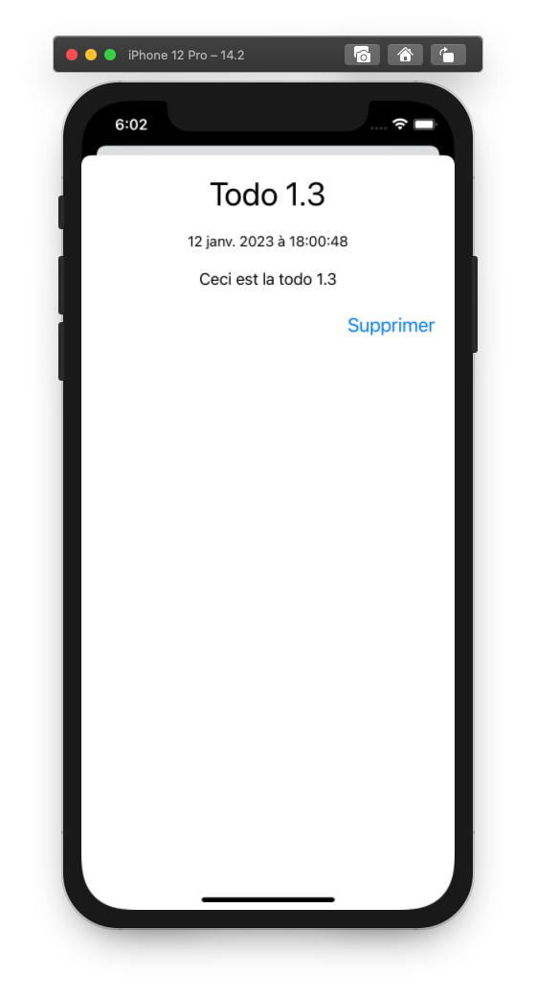

# IOS-TodoList

Ce projet est une application IOS permettant de gérer des listes de taches. Cette application a été développé dans le cadre de travaux pratique au sein de l’école ESIREM Dijon sous la tutelle de l’enseignant [D. GINHAC](https://github.com/dginhac).

## Description de l'application

L’application regroupe un total de 6 vues interconnectées manipulant un modèle simple composée de « Todo » et de « TodoList ».

### Page d’accueil

Cette vue nous permet de visualiser l’ensemble des différentes listes de taches de notre application. Nous y retrouvons un bouton pour ouvrir la vue de recherche de tâche, un autre pour nous diriger vers la création de liste de tâche et enfin nous pouvons cliquer sur nos listes de tâche pour visualiser les tâches de notre liste.

  

### Ajout de liste de tâche

Cette vue permet de nommer et de créer de nouvelle catégorie (liste de tâche)

  

### Liste de tâche

Cette vue nous permet visionner une liste de tâche. Nous y retrouvons un bouton pour supprimer la catégorie, un autre pour ajouter une tâche et enfin les tâches de la liste où nous pouvons les marquées finit avec le bouton switch ou alors cliquer dessus pour avoir plus de détaille.

  

### Ajout d'une tâche

Cette vue permet de créer une nouvelle tâche en définissant titre, date et description.

  

### Détaille d’une tâche

Cette vue nous permet de visualiser les différentes informations d’une tâche (titre, date, description). Nous y retrouvons un bouton pour la supprimer.

  

### Recherche de tâche

Cette dernière vue nous permet de rechercher des tâches dans l’ensemble de nos listes de tâches en fonction de son titre, sa date ou sa description. Nous y retrouvons dons un champ texte pour faire la recherche et nos tâches où nous pouvons les marquées finit avec un bouton switch ou alors cliquer dessus pour avoir plus de détaille.

  

## Auteurs

[Baptiste Andres](https://github.com/LeBourguignon)
